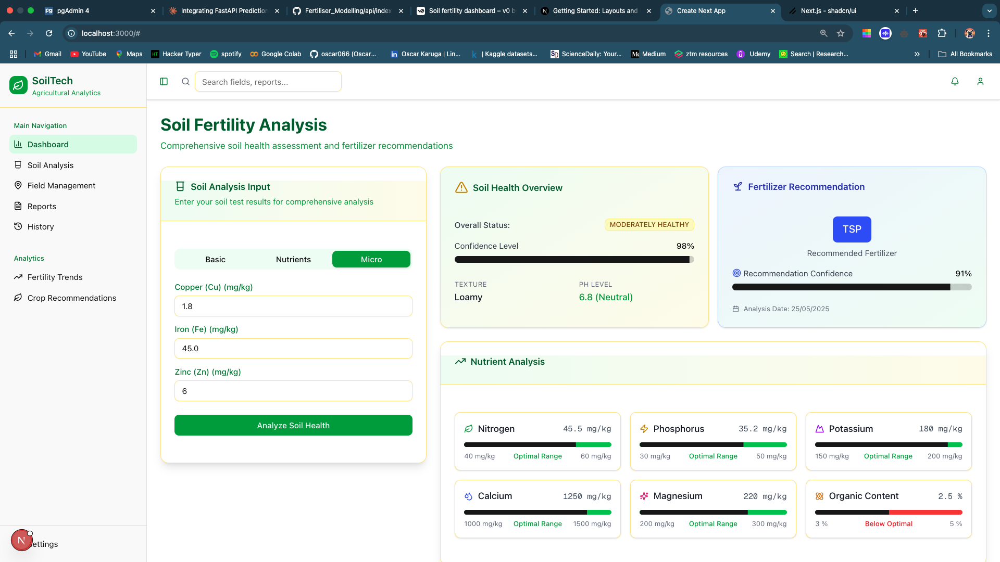
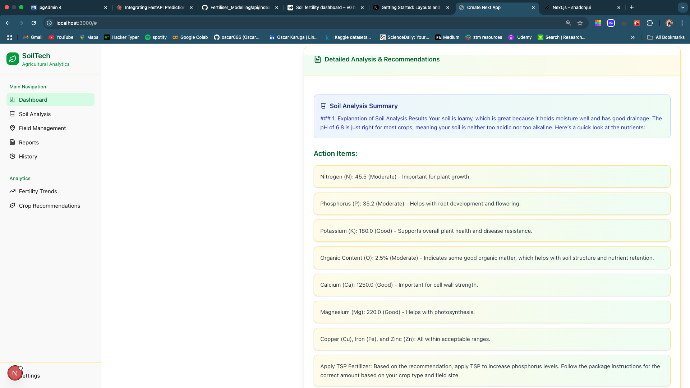

# Kiduka - Agricultural Decision Support System

Kiduka is a comprehensive agricultural decision support system designed to assist farmers and agricultural experts with soil fertility analysis, crop recommendations, and fertilizer optimization. The project integrates machine learning models trained on agricultural data with a modern web interface for seamless interaction.

## 📸 Screenshots


*Agricultural Dashboard and Analysis*


*Detailed Soil and Crop Recommendations*

---

## 🏗️ Project Structure

The project is organized into several key directories, each serving a specific purpose in the development, training, and deployment lifecycle:

- **[notebooks/](file:Kiduka/notebooks)**: The core of the project's intelligence. This is where all data preprocessing, exploratory data analysis (EDA), model training, and evaluation are performed before saving the trained models for API use.
- **[api/](file:Kiduka/api)**: The backend service built with FastAPI. It handles business logic, database interactions, and serves the machine learning models for real-time inferencing.
- **[client/](file:Kiduka/client)**: A modern, responsive frontend built with Next.js, providing an intuitive interface for users to interact with the system.
- **[data/](file:Kiduka/data)**: Central repository for all raw and processed datasets used across the project.
- **[eda_charts/](file:Kiduka/eda_charts)**: Storage for EDA visualizations, including distribution plots, correlation matrices, and model performance metrics like confusion matrices.
- **[database/](file:Kiduka/database)**: Contains SQL scripts and configuration files for setting up and managing the project's PostgreSQL database.
- **[scripts/](file:Kiduka/scripts)**: Utility scripts for deployment automation and CI/CD integration.
- **[models/](file:Kiduka/models)**: Directory where trained machine learning models are stored (as joblib or JSON files) to be loaded by the API.
- **[docker-compose.yml](file:Kiduka/docker-compose.yml)**: Orchestration file to build and run the entire project (API, Client, Database, Nginx) as a set of containers.

---

## 📓 Key Notebooks

The training and modeling phase is documented in several critical Jupyter notebooks:

1. **5 Major Nutrients Notebook**: Focuses on NPK (Nitrogen, Phosphorus, Potassium), pH, and Organic Matter (Org) for training soil fertility models.
2. **Soil Fertility Status Models Notebook**: Comprehensive soil fertility analysis including all nutrients and detailed Exploratory Data Analysis (EDA) of the dataset.
3. **[Fertilizer Classifier Notebook](file:Kiduka/notebooks/fertilizer_classifier-models-notbook.ipynb)**: Dedicated to the modeling and evaluation of the fertilizer recommendation engine.
4. **[Crop Recommendation Notebook](file:Kiduka/notebooks/crop-recommend-models-notebook.ipynb)**: Detailed modeling for crop recommendation based on environmental and soil factors.

---

## 🚀 Getting Started

The easiest way to get the project running locally is using Docker Compose. This ensures all services (Frontend, Backend, and Database) are correctly configured and interconnected.

### Prerequisites
- Docker and Docker Compose installed on your machine.
- A `.env` file configured in the root directory (refer to `.env.example` if available).

### Setup and Installation
1.  **Clone the repository**:
    ```bash
    git clone https://github.com/oscar066/Kiduka.git
    cd Kiduka
    ```

2.  **Build and start the containers**:
    ```bash
    docker-compose up --build
    ```

3.  **Access the application**:
    - **Frontend**: `http://localhost:80` (or the port specified in your Nginx config)
    - **API Documentation**: `http://localhost:8000/docs`

---

## 🛠️ Deployment & DevOps

The project includes built-in support for automated deployments:
- **Scripts**: Located in the `scripts/` folder to assist with server deployment.
- **GitHub Actions**: Automated CI/CD pipelines for testing and deployment (see [README_GITHUB_ACTIONS.md](file:Kiduka/README_GITHUB_ACTIONS.md) for detailed setup).

---

> [!NOTE]
> Trained models are exported from the notebooks to the `models/` or `api/` directory to be consumed by the FastAPI backend for real-time predictions.